# Rapport Technique — AuditBank : Application Fintech Sécurisée

> **Auteur :** Projet TP1 DevSec  
> **Stack :** Spring Boot 3.4 · Spring Security · JPA / Hibernate · Thymeleaf · MySQL  
> **Date :** Février 2026

---

## Table des Matières

1. [Présentation Générale](#1-présentation-générale)
2. [Technologies Utilisées](#2-technologies-utilisées)
3. [Architecture du Projet](#3-architecture-du-projet)
4. [Modèle de Données](#4-modèle-de-données)
5. [Sécurité — Spring Security en détail](#5-sécurité--spring-security-en-détail)
6. [Logique Métier et Validation](#6-logique-métier-et-validation)
7. [Interface Utilisateur (Frontend)](#7-interface-utilisateur-frontend)
8. [Gestion des Erreurs — Politique Zéro Crash](#8-gestion-des-erreurs--politique-zéro-crash)
9. [Guide de Lancement](#9-guide-de-lancement)
10. [Résumé des Vulnérabilités Corrigées](#10-résumé-des-vulnérabilités-corrigées)

---

## 1. Présentation Générale

**AuditBank** est une application bancaire de type Fintech développée avec Spring Boot. Elle simule un système de gestion de comptes bancaires avec deux rôles distincts :

- **Administrateur (ADMIN)** : peut voir tous les comptes, créer de nouveaux comptes, et effectuer des opérations financières supérieures à 1 000 €.
- **Client (CLIENT)** : peut voir uniquement ses propres comptes, gérer sa carte virtuelle, et effectuer des opérations limitées à 1 000 € maximum.

L'application met l'accent sur la **sécurité** (authentification, autorisation, protection des en-têtes HTTP, validation des entrées) et sur une **interface utilisateur moderne** de type SPA (Single Page Application) avec thème blanc minimaliste.

---

## 2. Technologies Utilisées


| Technologie | Rôle | Version |
|---|---|---|
| **Spring Boot** | Framework principal, serveur embarqué (Tomcat) | 3.4.2 |
| **Spring Security** | Authentification, autorisation, protection HTTP | 6.x |
| **Spring Data JPA** | Accès base de données via des interfaces Repository | 3.4.x |
| **Hibernate** | ORM — mapping objet-relationnel automatique | 6.x |
| **Thymeleaf** | Moteur de templates côté serveur | 3.x |
| **Jakarta Validation** | Annotations de validation (`@NotBlank`, `@Email`, `@Size`) | 3.x |
| **MySQL** | Base de données relationnelle | 8.x |
| **BCrypt** | Algorithme de hachage des mots de passe | — |
| **Maven** | Gestion des dépendances et build | — |

---

## 3. Architecture du Projet

### 3.1. Architecture en couches (MVC)

L'application suit le patron **Model-View-Controller** (MVC) avec une séparation stricte des responsabilités :


### 3.2. Arborescence des fichiers

```
AuditBankProject_TP1DevSec/
├── pom.xml                                    ← Dépendances Maven
├── src/main/java/
│   ├── com/auditbank/
│   │   └── AuditBankApplication.java          ← Point d'entrée
│   ├── controllers/
│   │   ├── LoginController.java               ← Route GET /login
│   │   ├── BankController.java                ← Routes comptes + transactions
│   │   └── GlobalExceptionHandler.java        ← Intercepteur global d'erreurs
│   ├── service/
│   │   └── BankService.java                   ← Logique métier + validation
│   ├── model/
│   │   ├── User.java                          ← Entité utilisateur
│   │   └── Account.java                       ← Entité compte bancaire
│   ├── repository/
│   │   ├── UserRepository.java                ← CRUD utilisateurs
│   │   └── AccountRepository.java             ← CRUD comptes
│   ├── security/
│   │   ├── SecuConfig.java                    ← Configuration Spring Security
│   │   ├── MySQLdbUserDetailsService.java     ← Chargement utilisateurs depuis MySQL
│   │   └── BankSecurityExpression.java        ← Vérification propriétaire de compte
│   └── init/
│       └── DataInitializer.java               ← Données de test (admin + clients)
├── src/main/resources/
│   ├── application.properties                 ← Configuration BDD + JPA
│   ├── static/styles/style.css                ← Design system CSS
│   └── templates/
│       ├── login.html                         ← Page de connexion
│       ├── admin/view_accounts.html           ← Dashboard administrateur
│       └── client/view_accounts.html          ← Dashboard client
```

---

## 4. Modèle de Données

### 4.1. Diagramme de classes

```mermaid
classDiagram
    class User {
        +String email       ← PK, @Email, @NotBlank, unique
        +String name        ← @NotBlank, @Size max 100
        +String password    ← @NotBlank, BCrypt hashé
        +String roles       ← "ADMIN" ou "CLIENT"
        +isAdmin() boolean
    }
    class Account {
        +int accountId      ← PK, auto-incrémenté
        +User owner         ← FK → users.email, NOT NULL
        +double balance     ← NOT NULL
        +credit(amount) void
        +debit(amount) void
    }
    User "1" --> "*" Account : possède
```



### 4.2. Schéma de la base de données

```mermaid
erDiagram
    USERS {
        VARCHAR email PK "NOT NULL, UNIQUE"
        VARCHAR name "NOT NULL, max 100"
        VARCHAR password "NOT NULL, BCrypt"
        VARCHAR roles "NOT NULL, max 50"
    }
    ACCOUNTS {
        INT account_id PK "AUTO_INCREMENT"
        VARCHAR owner_email FK "NOT NULL → users.email"
        DOUBLE balance "NOT NULL, défaut 0.0"
    }
    USERS ||--o{ ACCOUNTS : "possède"
```



### 4.3. Contraintes de validation

| Champ | Contrainte JPA | Validation Jakarta |
|---|---|---|
| `User.email` | `@Column(unique=true, nullable=false)` | `@Email` + `@NotBlank` |
| `User.name` | `@Column(nullable=false, length=100)` | `@NotBlank` + `@Size(max=100)` |
| `User.password` | `@Column(nullable=false)` | `@NotBlank` |
| `User.roles` | `@Column(nullable=false, length=50)` | `@NotBlank` |
| `Account.owner` | `@ManyToOne(optional=false)` + `@JoinColumn(nullable=false)` | — |
| `Account.balance` | `@Column(nullable=false)` | Vérification dans `credit()/debit()` |

---

## 5. Sécurité — Spring Security en détail

C'est le cœur du projet. Chaque requête HTTP passe par une **chaîne de filtres** Spring Security avant d'atteindre un contrôleur.

### 5.1. Vue d'ensemble du flux de sécurité

```mermaid
sequenceDiagram
    actor U as Utilisateur
    participant B as Navigateur
    participant SF as Spring Security FilterChain
    participant AC as AuthenticationProvider
    participant DB as MySQL (users)
    participant C as BankController
    participant S as BankService
    participant SE as BankSecurityExpression

    U->>B: GET /accounts
    B->>SF: Requête HTTP
    SF->>SF: Vérifier si URL est publique (/login, /css/**)
    SF-->>B: 302 Redirect → /login (non authentifié)
    U->>B: POST /login (email + mot de passe)
    B->>SF: Formulaire d'authentification
    SF->>AC: DaoAuthenticationProvider
    AC->>DB: SELECT * FROM users WHERE email = ?
    DB-->>AC: User (email, password hashé, rôle)
    AC->>AC: BCrypt.matches(plainPassword, hashedPassword)
    AC-->>SF: ✅ Authentication réussie
    SF->>SF: Créer session JSESSIONID
    SF-->>B: 302 Redirect → /accounts
    B->>SF: GET /accounts (avec cookie JSESSIONID)
    SF->>SF: Session valide → Authentifié
    SF->>C: BankController.viewAccounts()
    C->>C: Vérifier rôle (ADMIN ou CLIENT)
    C->>S: getAllAccounts() ou getAccountsByOwner()
    S-->>C: Liste de comptes
    C-->>B: Template HTML (admin ou client)
```



### 5.2. Configuration Spring Security (`SecuConfig.java`)

La classe `SecuConfig` est le fichier central de sécurité. Voici chaque mécanisme expliqué :

#### 5.2.1. Filtrage des URLs

```java
.authorizeHttpRequests(auth -> auth
    .requestMatchers("/login", "/css/**", "/styles/**", "/images/**", "/error").permitAll()
    .anyRequest().authenticated()
)
```

| Règle | Signification |
|---|---|
| `/login` → `permitAll()` | Page de connexion accessible sans authentification |
| `/css/**`, `/styles/**` | Fichiers CSS publics (nécessaire pour afficher le style du login) |
| `/error` → `permitAll()` | Page d'erreur par défaut accessible |
| `anyRequest().authenticated()` | **Toute autre URL** nécessite un utilisateur connecté |

#### 5.2.2. Authentification par formulaire

```java
.formLogin(form -> form
    .loginPage("/login")                       // Page de login personnalisée
    .loginProcessingUrl("/login")              // URL de traitement POST
    .defaultSuccessUrl("/accounts", true)       // Après login réussi → /accounts
    .failureUrl("/login?error=true")            // Après échec → affiche toast erreur
)
```

**Processus :**
1. L'utilisateur soumet email + mot de passe via `POST /login`
2. Spring Security délègue à `DaoAuthenticationProvider`
3. Le provider appelle `MySQLdbUserDetailsService.loadUserByUsername(email)`
4. Le service charge l'utilisateur depuis MySQL et retourne ses rôles
5. BCrypt compare le mot de passe en clair avec le hash stocké
6. Si OK → redirection vers `/accounts` avec session créée

#### 5.2.3. Gestion de la déconnexion

```java
.logout(logout -> logout
    .logoutUrl("/logout")                      // URL pour se déconnecter
    .logoutSuccessUrl("/login?logout")          // Redirect après logout
    .invalidateHttpSession(true)                // Détruit la session côté serveur
    .deleteCookies("JSESSIONID")               // Supprime le cookie côté navigateur
)
```

> **🔒 Pourquoi les deux ?** `invalidateHttpSession` détruit la session sur le serveur, mais si le cookie reste dans le navigateur, un attaquant pourrait tenter de le réutiliser. `deleteCookies` supprime physiquement le cookie.

#### 5.2.4. En-têtes de sécurité HTTP

```java
.headers(headers -> headers
    .contentTypeOptions(cto -> {})
    .frameOptions(fo -> fo.deny())
    .xssProtection(xss -> xss.headerValue(ENABLED_MODE_BLOCK))
    .contentSecurityPolicy(csp -> csp.policyDirectives("..."))
)
```

| En-tête | Protection contre | Valeur |
|---|---|---|
| `X-Content-Type-Options: nosniff` | MIME Sniffing | Le navigateur n'interprète pas un fichier comme un type différent |
| `X-Frame-Options: DENY` | **Clickjacking** | Empêche l'inclusion de l'app dans une `<iframe>` |
| `X-XSS-Protection: 1; mode=block` | Cross-Site Scripting (XSS) | Le navigateur bloque la page si XSS détecté |
| `Content-Security-Policy` | Injection de scripts/styles | Autorise uniquement les sources de confiance |
| `Referrer-Policy: strict-origin-when-cross-origin` | Fuite d'informations | Contrôle les données envoyées dans l'en-tête Referer |
| `Strict-Transport-Security: max-age=31536000` | Downgrade HTTPS→HTTP | Force le navigateur à toujours utiliser HTTPS (HSTS) |

**Détail du CSP :**

```
default-src 'self';                          → Par défaut : uniquement notre domaine
style-src 'self' https://fonts.googleapis.com 'unsafe-inline';  → CSS : nous + Google Fonts
font-src 'self' https://fonts.gstatic.com;   → Polices : nous + Google Fonts
img-src 'self' data:;                        → Images : nous + inline (data:)
script-src 'self' 'unsafe-inline';           → JS : notre domaine + inline
```

#### 5.2.5. Enforcement HTTPS et Redirection HTTP→HTTPS

```java
// Dans SecuConfig.java — Force TOUTES les requêtes à passer par HTTPS
.requiresChannel(channel -> channel
    .anyRequest().requiresSecure())
```

**Configuration SSL dans `application.properties` :**

```properties
# Port principal : HTTPS sur 8443
server.port=8443

# Certificat SSL (Keystore JKS)
server.ssl.key-store=classpath:tp1-devsec-keystore.jks
server.ssl.key-store-password=tp1devsec
server.ssl.key-store-type=JKS
server.ssl.key-alias=tomcat
```

**Redirection automatique HTTP (8080) → HTTPS (8443) :**

```java
@Bean
public WebServerFactoryCustomizer<TomcatServletWebServerFactory> httpToHttpsRedirect() {
    return factory -> {
        Connector httpConnector = new Connector(TomcatServletWebServerFactory.DEFAULT_PROTOCOL);
        httpConnector.setScheme("http");
        httpConnector.setPort(8080);
        httpConnector.setSecure(false);
        httpConnector.setRedirectPort(8443);
        factory.addAdditionalTomcatConnectors(httpConnector);
    };
}
```

> **🔒 Résultat :** Toute requête sur `http://localhost:8080` est automatiquement redirigée vers `https://localhost:8443`. L'en-tête HSTS garantit que le navigateur n'utilise plus jamais HTTP après la première visite.

#### 5.2.6. Gestion des sessions

```java
.sessionManagement(session -> session
    .maximumSessions(1)                       // Un seul appareil par utilisateur
    .expiredUrl("/login?expired=true")         // Redirect si session expirée
)
```

> **🔒 Pourquoi limiter à 1 session ?** Si un attaquant vole les identifiants d'un utilisateur, celui-ci sera déconnecté dès que l'attaquant se connecte, ce qui est un signal d'alerte immédiat.

#### 5.2.7. Hachage des mots de passe (BCrypt)

```java
@Bean
public PasswordEncoder passwordEncoder() {
    return new BCryptPasswordEncoder();
}
```

**BCrypt** est un algorithme de hachage adaptatif :
- **Irréversible** : impossible de retrouver le mot de passe à partir du hash
- **Salé** : chaque hash est unique même pour le même mot de passe
- **Coûteux** : chaque vérification prend ~100ms, rendant les attaques brute-force impraticables

```
Mot de passe : "admin123"
Hash BCrypt  : "$2a$10$xJ7Kq..." (60 caractères, différent à chaque encode())
```

### 5.3. Autorisation par rôle (RBAC)

Le système utilise le **contrôle d'accès basé sur les rôles** (Role-Based Access Control).

```mermaid
graph TD
    subgraph "ROLE_ADMIN"
        A1["Voir TOUS les comptes"]
        A2["Créer un compte"]
        A3["Opérations > 1000 €"]
    end
    subgraph "ROLE_CLIENT"
        B1["Voir SES comptes uniquement"]
        B2["Opérations ≤ 1000 €"]
        B3["Gérer sa carte virtuelle"]
    end
    subgraph "Logique de contrôle"
        C1["@PreAuthorize dans BankService"]
        C2["BankSecurityExpression.isAccountOwner()"]
    end
    A1 & A2 & A3 --> C1
    B1 & B2 --> C1
    B1 --> C2
```



#### Exemples d'annotations `@PreAuthorize` :

```java
// Seul un admin peut créer un compte
@PreAuthorize("hasRole('ADMIN')")
public void createAccount(String email) { ... }

// Admin OU client propriétaire du compte
@PreAuthorize("hasRole('ADMIN') or (hasRole('CLIENT') and @bankSecurityExpression.isAccountOwner(authentication, #accountId))")
public void debit(int accountId, double amount, boolean isAdmin) { ... }
```

#### `BankSecurityExpression.isAccountOwner()` :

```java
public boolean isAccountOwner(Authentication authentication, int accountId) {
    String loggedInEmail = authentication.getName();      // Email de l'utilisateur connecté
    Account account = accountRepository.findById(accountId).orElse(null);
    if (account == null) return false;                     // Compte inexistant → refusé
    return account.getOwner().getEmail().equals(loggedInEmail);  // Comparaison
}
```

> **🔒 Résultat :** Un client ne peut JAMAIS accéder au compte d'un autre client.

### 5.4. Schéma récapitulatif de toutes les couches de sécurité

```mermaid
graph TB
    subgraph "Couche 0 — Transport"
        L0["TLS/HTTPS obligatoire<br/>Keystore JKS · Port 8443<br/>HSTS · Redirection HTTP→HTTPS"]
    end
    subgraph "Couche 1 — Réseau"
        L1["En-têtes HTTP<br/>CSP · X-Frame-Options · XSS<br/>Referrer-Policy · HSTS"]
    end
    subgraph "Couche 2 — Authentification"
        L2["Spring Security FilterChain<br/>Form Login · BCrypt · Sessions"]
    end
    subgraph "Couche 3 — Autorisation"
        L3["@PreAuthorize<br/>RBAC (ADMIN/CLIENT)"]
        L3b["isAccountOwner()<br/>Vérification de propriété"]
    end
    subgraph "Couche 4 — Validation Métier"
        L4["validateAmount()<br/>Montant > 0, limites par rôle<br/>Anti auto-virement"]
    end
    subgraph "Couche 5 — Intégrité BDD"
        L5["@Column constraints<br/>@Email · @NotBlank · @Size<br/>FK NOT NULL"]
    end
    subgraph "Couche 6 — Gestion d'Erreurs"
        L6["GlobalExceptionHandler<br/>@ControllerAdvice<br/>Zéro Error 500"]
    end

    L0 --> L1 --> L2 --> L3 --> L4 --> L5
    L3 --> L3b
    L4 --> L6
```



---

## 6. Logique Métier et Validation

### 6.1. Règles métier

| Règle | Implémentation |
|---|---|
| Montant strictement positif | `if (amount <= 0)` dans `validateAmount()` + `credit()` + `debit()` |
| Admin : opérations > 1 000 € | `if (isAdmin && amount <= 1000)` → exception |
| Client : opérations ≤ 1 000 € | `if (!isAdmin && amount > 1000)` → exception |
| Fonds suffisants pour débit | `if (amount > this.balance)` dans `Account.debit()` |
| Pas d'auto-virement | `if (fromAccountId == toAccountId)` dans `transfer()` |
| Email valide pour création de compte | `email.trim().toLowerCase()` + vérification en BDD |

### 6.2. Flux d'une transaction

```mermaid
sequenceDiagram
    actor U as Utilisateur
    participant C as BankController
    participant S as BankService
    participant A as Account Entity
    participant DB as MySQL

    U->>C: POST /transaction (accountId, DEBIT, 500€)
    C->>C: Déterminer le rôle (ADMIN/CLIENT)
    C->>S: debit(accountId=2, amount=500, isAdmin=false)
    S->>S: validateAmount(500, false) ✅ (0 < 500 ≤ 1000)
    S->>S: @PreAuthorize → isAccountOwner(auth, 2) ✅
    S->>DB: SELECT * FROM accounts WHERE id = 2
    DB-->>S: Account(balance=1500)
    S->>A: account.debit(500)
    A->>A: 500 > 0 ✅ · 500 ≤ 1500 ✅
    A->>A: balance = 1500 - 500 = 1000
    S->>DB: UPDATE accounts SET balance=1000 WHERE id=2
    S-->>C: Succès
    C-->>U: Redirect /accounts + toast "DEBIT of 500 € completed"
```



### 6.3. Intégrité transactionnelle

Le `BankService` est annoté `@Transactional`. Cela signifie que pour un **transfert entre deux comptes** :

```java
fromAccount.debit(amount);    // Étape 1
toAccount.credit(amount);     // Étape 2
accountRepository.save(fromAccount);
accountRepository.save(toAccount);
```

Si l'étape 2 échoue (par exemple, exception), **l'étape 1 est automatiquement annulée** (rollback). L'argent ne "disparaît" jamais.

---

## 7. Interface Utilisateur (Frontend)

### 7.1. Architecture SPA

L'interface simule une **Single Page Application** : les sections sont toutes présentes dans le HTML mais seule une est visible à la fois. Le basculement se fait en JavaScript sans rechargement de page.

```mermaid
graph LR
    subgraph "Admin Dashboard"
        S1["Section : Dashboard<br/>Balance · KPIs · Quick Actions"]
        S2["Section : Accounts<br/>Table + Recherche"]
        S3["Section : Transfers<br/>Formulaire de transaction"]
    end
    subgraph "Client Dashboard"
        S4["Section : Home<br/>Balance · Comptes"]
        S5["Section : Cards<br/>Carte virtuelle · Contrôles"]
        S6["Section : Transfers<br/>Formulaire limité à 1000€"]
    end
    SB["Sidebar Collapsible<br/>250px ↔ 64px"]
    SB --> S1 & S2 & S3
    SB --> S4 & S5 & S6
```



### 7.2. Navigation collapsible

La sidebar peut basculer entre :
- **Mode ouvert** (250px) : icône + texte
- **Mode réduit** (64px) : icône seule

Le bouton `◀/▶` déclenche `toggleSidebar()` qui ajoute/retire la classe CSS `.collapsed`.

Sur **mobile** (≤ 1024px), la sidebar est remplacée par une **barre de navigation inférieure** (Bottom Bar).

### 7.3. Système de notifications (Toasts)

Les messages de succès/erreur sont affichés sous forme de **toasts** (notifications non-bloquantes) :

| Type | Déclencheur | Couleur |
|---|---|---|
| ✅ Succès | Transaction réussie, compte créé | Vert `#10B981` |
| ❌ Erreur | Validation échouée, accès refusé | Rouge `#EF4444` |
| ⚠️ Avertissement | Session expirée | Jaune `#F59E0B` |

Les toasts **s'auto-ferment après 5 secondes** et peuvent être fermés manuellement.

### 7.4. Design System

| Propriété | Valeur |
|---|---|
| Fond principal | `#F7F8FA` (gris très pâle) |
| Cartes | `#FFFFFF` + ombre douce (`box-shadow`) |
| Couleur d'accent | `#0052CC` (Bleu Saphir) |
| Typographie | Inter (Google Fonts) |
| Bordures | Aucune visible — remplacées par des ombres |
| Bouton primaire | Bleu saphir, coins arrondis 10px, texte blanc bold |

---

## 8. Gestion des Erreurs — Politique Zéro Crash

### 8.1. Le problème initial

Sans `GlobalExceptionHandler`, toute exception non attrapée provoquait une **Error 500** avec une page blanche ou un stack trace Java visible (fuite d'information).

### 8.2. La solution : `@ControllerAdvice`

```mermaid
graph LR
    A["Exception dans BankService"] --> B["GlobalExceptionHandler"]
    B --> C{"Type ?"}
    C -->|IllegalArgumentException| D["Flash 'error' + redirect /accounts"]
    C -->|AccessDeniedException| E["Flash 'Accès refusé' + redirect"]
    C -->|Exception générique| F["Flash 'Erreur inattendue' + redirect"]
    D & E & F --> G["Toast rouge sur la page"]
```



**Résultat :** L'utilisateur ne voit **jamais** de page d'erreur technique. Il reçoit toujours un message clair dans un toast.

### 8.3. Pattern PRG (Post-Redirect-Get)

Le contrôleur utilise `RedirectAttributes` au lieu de `Model` pour les messages :

```
POST /transaction → Erreur → flash("error", "Fonds insuffisants") → 302 /accounts → GET /accounts → Toast
```

**Avantage :** Si l'utilisateur rafraîchit la page après une erreur, le formulaire n'est PAS resoumis.

---

## 9. Guide de Lancement

### Prérequis

- Java 21 (JDK)
- MySQL 8 en cours d'exécution sur `localhost:3306`
- Maven (inclus dans Eclipse)

### Étapes

```bash
# 1. S'assurer que MySQL est démarré
# La base 'db_bank' est créée automatiquement grâce à createDatabaseIfNotExist=true

# 2. Dans Eclipse :
#    Clic droit sur le projet → Maven → Update Project (Alt+F5)

# 3. Exécuter AuditBankApplication.java en tant que Java Application

# 4. Ouvrir le navigateur : https://localhost:8443
#    (Le certificat est auto-signé → accepter l'avertissement du navigateur)
#    Note : http://localhost:8080 redirige automatiquement vers HTTPS
```

### Comptes de test

| Rôle | Email | Mot de passe | Solde initial |
|---|---|---|---|
| Admin | `admin@bank.com` | `admin123` | 50 000 € |
| Client 1 | `client1@bank.com` | `client123` | 1 500 € + 200 € |
| Client 2 | `client2@bank.com` | `client123` | 3 500 € |

> **⚠️ Premier lancement après refactoring :** Exécuter `DROP DATABASE db_bank;` dans MySQL avant de démarrer l'application, afin que le `DataInitializer` recrée les données avec les mots de passe hashés en BCrypt.

---

## 10. Résumé des Vulnérabilités Corrigées

| # | Vulnérabilité | Gravité | Correction |
|---|---|---|---|
| 1 | Aucun intercepteur d'erreurs → Error 500 | 🔴 Critique | `GlobalExceptionHandler` (`@ControllerAdvice`) |
| 2 | Montants négatifs acceptés | 🔴 Critique | Validation `amount <= 0` à 3 niveaux |
| 3 | Auto-virement possible | 🟡 Moyen | Guard `fromAccountId == toAccountId` |
| 4 | Aucune contrainte en BDD | 🟡 Moyen | `@Column(unique, nullable, length)` |
| 5 | Aucune validation d'entrée | 🟡 Moyen | `@Email`, `@NotBlank`, `@Size` |
| 6 | Pas d'en-têtes de sécurité HTTP | 🔴 Critique | CSP, X-Frame-Options DENY, XSS-Protection |
| 7 | Sessions illimitées par utilisateur | 🟡 Moyen | `maximumSessions(1)` |
| 8 | Session non détruite au logout | 🟡 Moyen | `invalidateHttpSession` + `deleteCookies` |
| 9 | Fonds insuffisants non vérifiés dans l'entité | 🟡 Moyen | `Account.debit()` vérifie `amount > balance` |
| 10 | Données stales après erreur de formulaire | 🟢 Faible | Pattern PRG avec `RedirectAttributes` |
| 11 | Fichiers legacy morts dans le code | 🟢 Faible | Suppression des dossiers `exceptions/` |
| 12 | Packaging WAR incompatible | 🟢 Faible | Changé en `jar` |
| 13 | `ddl-auto=create` efface la BDD | 🔴 Critique | Changé en `update` |
| 14 | Dépendance validation manquante | 🟢 Faible | Ajout `spring-boot-starter-validation` |
| 15 | Communication en clair (HTTP) | 🔴 Critique | TLS/HTTPS obligatoire (port 8443), keystore JKS, redirection HTTP→HTTPS |
| 16 | Pas de HSTS | 🟡 Moyen | `Strict-Transport-Security: max-age=31536000; includeSubDomains` |
| 17 | Pas de Referrer-Policy | 🟢 Faible | `Referrer-Policy: strict-origin-when-cross-origin` |
